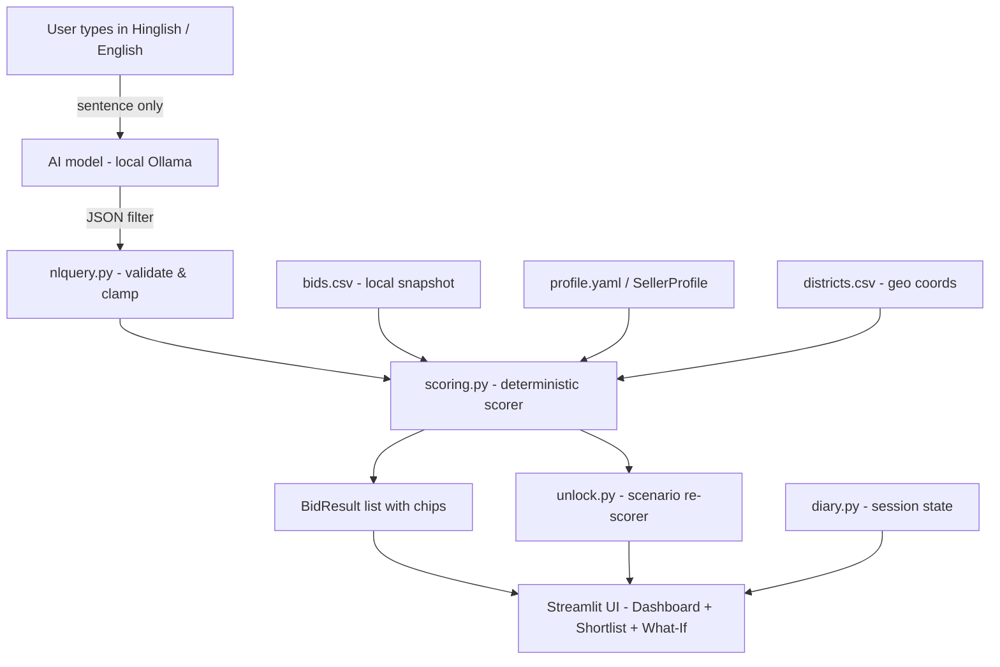

# BidMitra – GeM Bid Shortlister for Small Suppliers

> **Other tools show you tenders. BidMitra tells you which ones are worth your time, and why.**

BidMitra is a decision-support tool for small industrial suppliers on India's [GeM portal](https://gem.gov.in) (Government e-Marketplace). It shortlists matching bids from a local snapshot in seconds, explains *why* each bid was shown, lets you track your bidding activity, and understands requests typed in Hinglish — powered by a small open-weight AI model running locally.

---

## 1. What it does

**The problem:** Small suppliers on GeM spend hours searching hundreds of tenders to find the handful that match their product range, location, and capital limits. GeM's own search is keyword-only and returns no explanation.

**GeM** (Government e-Marketplace) is India's official government procurement portal where central and state government organisations publish bids for goods and services.

**Who it's for:** Industrial maintenance spare-parts suppliers — timing belts, pulleys, valves, safety equipment — operating from Tier-2 cities like Panipat, Haryana, who deliver within a fixed radius and have a fixed EMD limit.

**What BidMitra does:**
- Matches bids from a local CSV snapshot against the supplier's profile (item families, delivery radius, max EMD, time left)
- Explains every match with plain-language reason chips: *"Consignee Karnal, 32 km"*, *"EMD ₹30,000 (within limit)"*, *"5 days left"*
- Shows what the supplier could change to unlock more bids (What-If scenarios)
- Finds "almost matched" bids — bids just slightly outside the limit
- Maintains a **Bid Diary** (self-reported: Saved → Applied → Won/Lost)
- Supports **multiple seller profiles** (Panipat spares, Mohali furniture, Ludhiana safety equipment)
- Understands typed queries in Hindi/Hinglish/English via a local open-weight AI model

**What BidMitra does NOT do:** scraping, logging in to GeM, submitting bids, or accessing any external API. All bid data is local and read-only.

---

## 2. Demo


*Screenshot coming after first run. See `docs/demo_script.md` for a 2-minute walkthrough.*

Live demo: `<FILL_DEMO_URL>` *(Streamlit Community Cloud — AI box shows its fallback message there because the local model is not available in the cloud)*

---

## 3. How to run

### Quickstart without AI (4 commands)

```bash
git clone https://github.com/your-org/bidmitra
cd bidmitra
pip install -r requirements.txt
python scripts/make_sample_data.py   # generates ~117 SAMPLE bids
streamlit run app.py
```

Open http://localhost:8501. All features work except the Hinglish query box, which shows a friendly fallback.

### Quickstart with the local AI (Ollama)

1. Install Ollama: https://ollama.com/download
2. Pull a small model:
   ```bash
   ollama pull phi3:mini     # 3.8 B params, ~2 GB
   # or: ollama pull llama3.2:3b
   # or: ollama pull qwen2.5:3b
   ```
3. Set environment variables (copy `.env.example` to `.env`):
   ```bash
   cp .env.example .env
   # Edit .env: set OPEN_LLM_MODEL=phi3:mini (or your chosen model)
   ```
4. Run:
   ```bash
   streamlit run app.py
   ```

### Sample data vs real data

| Source | How | Data source label |
|--------|-----|-------------------|
| `python scripts/make_sample_data.py` | Generates ~117 synthetic SAMPLE bids | 🔴 SAMPLE DATA banner shown |
| Your real GeM snapshot | Export from GeM, save as `data/bids.csv` | No banner (if data_source ≠ SAMPLE) |

Always verify on the official GeM bid document before bidding.

### Environment variables

| Variable | Default | Description |
|----------|---------|-------------|
| `LLM_PROVIDER` | `ollama` | `ollama` or `openai_compatible` |
| `OLLAMA_BASE_URL` | `http://localhost:11434` | Local Ollama base URL |
| `OPEN_LLM_MODEL` | *(none)* | Model name (required for AI) |
| `OPEN_LLM_BASE_URL` | `http://localhost:8000` | For `openai_compatible` provider |
| `OPEN_LLM_API_KEY` | *(none)* | API key (optional) |
| `OPEN_LLM_LICENSE_URL` | *(none)* | Shown as link in the AI badge |

---

## 4. AI model

**Model:** Set via `OPEN_LLM_MODEL` environment variable. Example: `phi3:mini` (Microsoft Phi-3 Mini, 3.8 B parameters), `llama3.2:3b` (Meta Llama 3.2, 3 B parameters), or any other model ≤ 10 B parameters available in Ollama.

**Parameter size:** ≤ 10 B (small, local, fast).

**How it is used:** The model has exactly **one job** — converting a typed sentence (Hindi/Hinglish/English) into a structured JSON filter:
```json
{"item_family": "valves", "max_emd_inr": 30000, "radius_km": null, "location_text": null}
```
It **never sees** bid data or the supplier profile. All matching, scoring, and ranking is done by deterministic Python code in `src/scoring.py`.

**Model license or terms:** `<FILL_MODEL_LICENSE_URL>`
*(Replace this placeholder with the actual URL for the model you are using before submission. Open-weight does not automatically mean open-source — check the model's own license.)*

**Privacy:** Only the typed sentence is sent to the model. With Ollama (the default), it never leaves your machine. With an `openai_compatible` endpoint, it goes to the configured server only.

**Eval accuracy:** Not measured *(run `python scripts/eval_nlquery.py` with the model running to get a real number and paste it here)*.

---

## 5. Key dependencies

| Package | Version | License |
|---------|---------|---------|
| [Streamlit](https://streamlit.io) | ≥1.35 | [Apache 2.0](https://github.com/streamlit/streamlit/blob/develop/LICENSE) |
| [pandas](https://pandas.pydata.org) | ≥2.0 | [BSD 3-Clause](https://github.com/pandas-dev/pandas/blob/main/LICENSE) |
| [PyYAML](https://pyyaml.org) | ≥6.0 | [MIT](https://github.com/yaml/pyyaml/blob/master/LICENSE) |
| [requests](https://requests.readthedocs.io) | ≥2.31 | [Apache 2.0](https://github.com/psf/requests/blob/main/LICENSE) |
| [pytest](https://pytest.org) | ≥8.0 | [MIT](https://github.com/pytest-dev/pytest/blob/main/LICENSE) |

No proprietary AI SDK is used. See `THIRD_PARTY.md` for full details.

---

## 6. How it works



**Key design decisions:**
- The AI model is a thin text→JSON adapter only. It never ranks bids.
- Scoring is 100% deterministic and tested: item 35%, location 30%, EMD 20%, time 15%.
- Missing or unknown data → neutral "Check" chip, never guessed.
- Days-left uses `snapshot_meta.yaml` `as_of` date, not the real clock, so demos are stable.
- Profiles and bid diary are stored in `st.session_state` only (no database, no filesystem writes).

---

## 7. How we built it

AI-assisted coding tools were used throughout development.

`<FILL_WHAT_WE_WROTE_OURSELVES>` — *Replace this placeholder with what the team designed and wrote: the scoring formula, the profile model, the honesty rules, the GeM domain knowledge contributed by the real user (Panipat supplier), and any other original work.*

Domain input from the real user: my father, who supplies industrial maintenance spares to refineries from Panipat, Haryana. His daily workflow — searching bids, estimating EMD, calculating delivery distance — directly shaped every feature.

---

## 8. Limits

- **Snapshot only:** Bid data comes from a local CSV file. BidMitra does not connect to GeM.
- **Not legal advice:** This is a decision-support tool. Always verify on the official GeM bid document before bidding.
- **AI only interprets the query:** The model converts your typed sentence to a filter. It does not rank, score, or see bid data.
- **Self-declared profiles:** All profile data (MSE status, certifications, documents) is self-declared. Nothing is verified against official sources (GSTIN, Udyam, etc.). Verification is on the roadmap.
- **Session-only storage:** Profiles and bid diary are lost when the browser tab is closed. Persistent storage is on the roadmap.
- **No authentication:** Demo mode only. Real accounts are on the roadmap.

---

## 9. Roadmap

| Feature | Description |
|---------|-------------|
| 🗺️ Map view | Show consignee locations on a map with radius circle |
| 🎓 Skip-to-Teach | Teach BidMitra why you skipped a bid to improve future scoring |
| 📄 Spec parser | Extract technical specs from bid PDF attachments |
| 🗄️ Document vault | Store and link your own certificates and documents |
| 📅 Digest & calendar | Daily email digest + calendar alerts for closing bids |
| 🔐 Authentication | Real user accounts with persistent storage |
| ✅ Official verification | Verify GSTIN, Udyam registration against official sources |

---

## 10. Contributing and License

See [CONTRIBUTING.md](CONTRIBUTING.md) for how to add districts, item families, or scenarios.

Issues labelled `good first issue` are in [docs/good_first_issues.md](docs/good_first_issues.md).

**License:** MIT — see [LICENSE](LICENSE).

**This project uses an open-weight AI model.** Open-weight does not automatically mean open-source. See the model's own license (link in Section 4).
